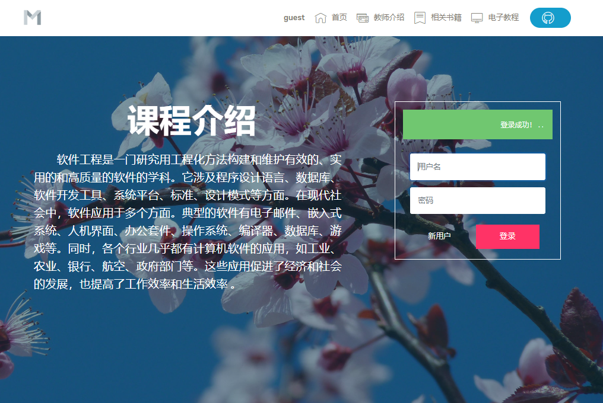
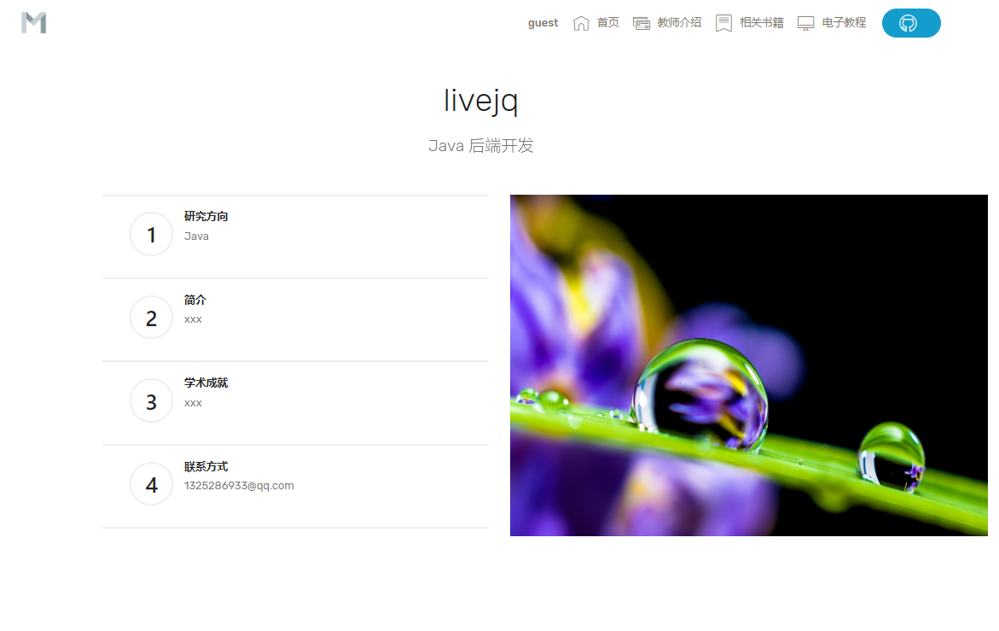
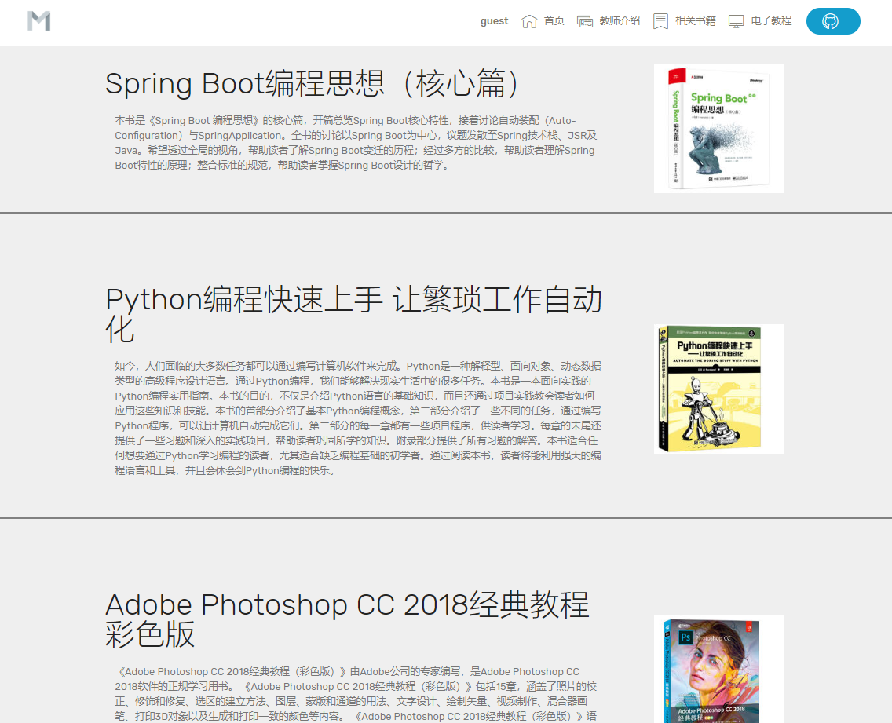
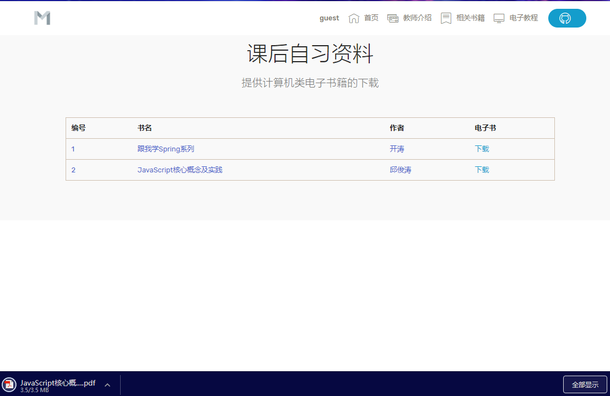
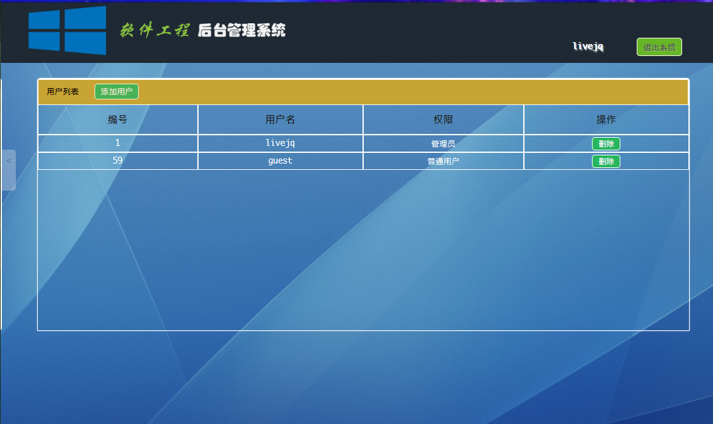
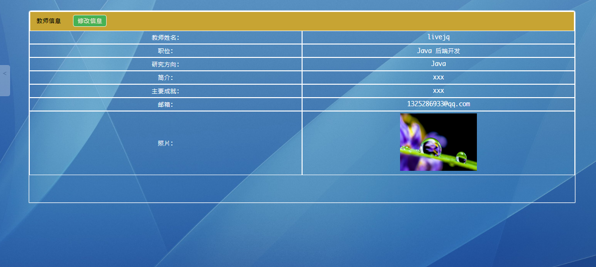
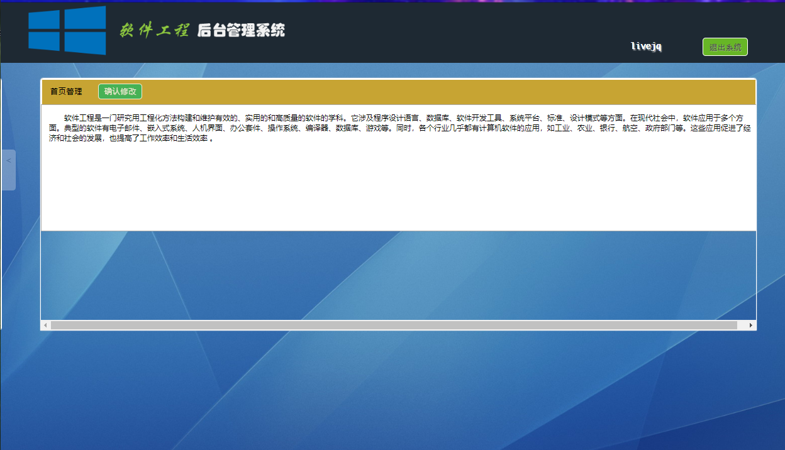
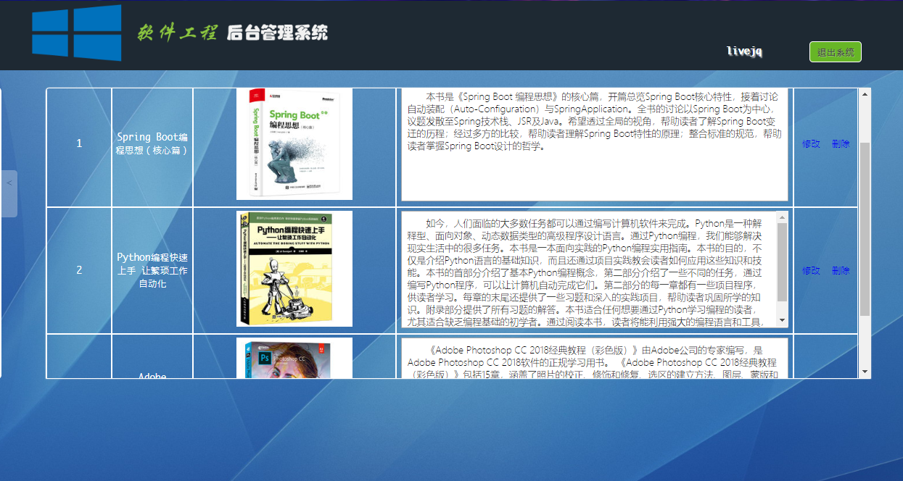
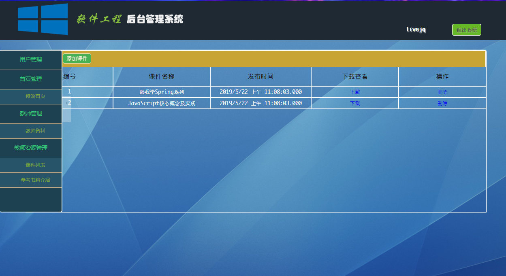

## 基于 Struts 2.x 和 Hibernate 3.x 编写的一个Demo

#### 前台

基于JQuery的Ajax请求来获取资源，若无响应则直接使用js解析本地文本文件。运用js的监听来获取上传进度，从而实现一个进度条。运用localStorage来实现客户端的短暂存储，以便限制用户未登录的状态进行下载电子书。

----------

#### 后台

数据的存储管理则交由Hibernate，通过ORM将实体类映射到数据库中的相应的数据表中，然后通过对象图导航语言、HQL、QBC、或直接的SQL语句来实现业务控制，其一级缓存极大的提高了响应速度，二级缓存则并未十分了解；使用Struts来响应客户端的请求，并返回JSON格式的数据（其中有返回XML格式，但终究还是JSON格式的较为简洁和便利），其中用到了struts-dojo-xxx.jar这个包。

